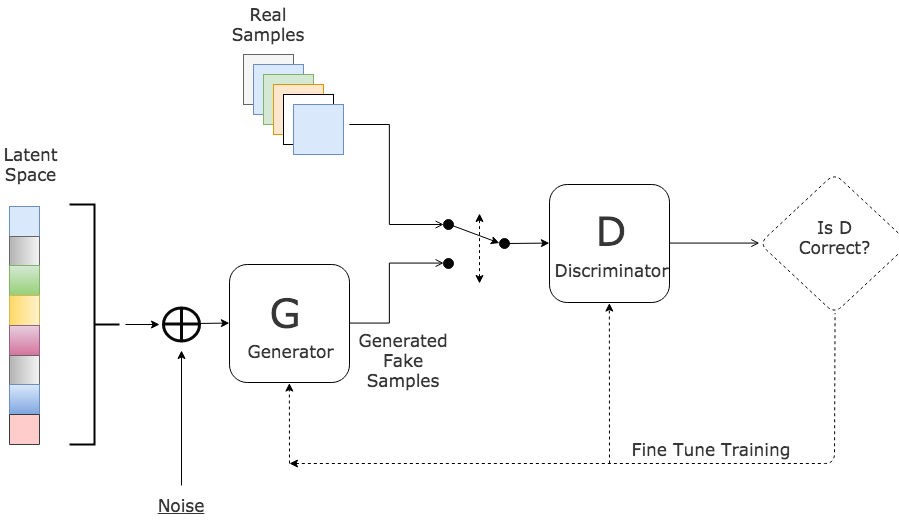
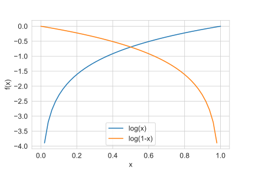
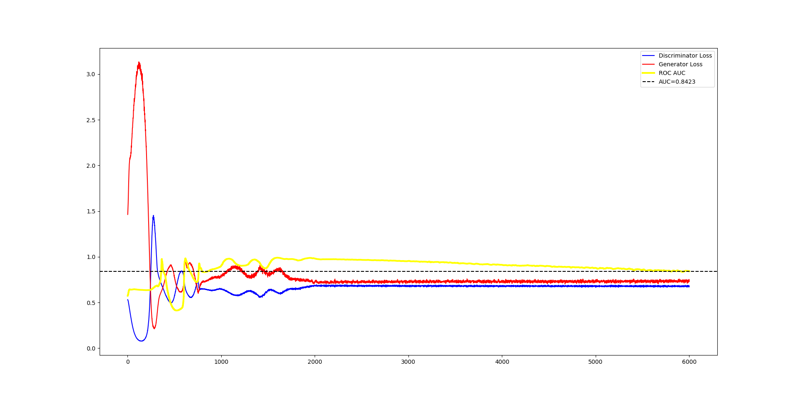

<h1 align='center'>Generative Adversarial Networks for unsupervised outlier detection</h1>

## Introduction

The problem we are going to address in this post is that of outlier detection, which is the identification of observations that raise suspicions by differing significantly from the majority of the ordinary data. Applications are countless: from fraud detection, to intrusion detection or health monitoring. 

Traditionally, the outliers detection problem is seen as supervised learning problem; a binary classification issue where we train a classifier to learn a boundary between the two classes; normal data and outliers. But these types of discriminative models tend to perform poorly, mainly due to the problem of unbalanced data. In fact, outliers, due to their rarity, generally represent a rather small percentage compared to the normal data. This lack of balance between the classes largely compromises the learning. There are several solutions to address this problem such as oversampling or under-sampling of the data before the training but we are not going to address them because they are used in a supervised learning schema. The main reason why we are not interested in the supervised learning schema is to avoid the labor of manually labeling the training data. As we will see later in this post, using a generative adversarial model will help us automate this tedious task.

The remainder of this post will be organized as follows:

- 1) Presentation of the GAN architecture.
- 2) How the GAN is trained from a mathematical point of view.
- 3) Framing the outliers detection problem using GANs.
- 4) Python implementation along with the results.

Without further ado, let's get started. 

## GAN architecture

In Machine Learning, two kinds of models exist; generative models and discriminative models. 

Given a data set of samples and their corresponding labels $(X, y)$, a discriminative model will learn the boundary between the different labels; the conditional probability $P(y|X)$, while a generative model will learn the probability distribution that generates a sample of a given class $y$, $P(X|y)$.

Generative Adversarial Networks (GAN) are a type of neural networks belonging to the class of generative models, as their name implies. They consist of two communicating neural networks: a generator (G) and a discriminator (D). (G) takes as input a noise and returns a generated sample, while (D)'s job is to learn the boundary between generated samples and real samples. Since GAN learn the probability distribution underlying the training data, we can then use them to generate a data point that does not necessarily belong to the training data but it is part of the range of possibilities and thus it can be a novel data point.

This [neural networks' architecture](https://arxiv.org/abs/1406.2661), that was proposed back in 2014 by Ian GoodFellow and others from the University of Montreal, has become the go-to when it comes to image generation, video generation and speech synthesis. But that's not an exhaustive list of its applications. In fact, several attempts have also been made to solve problems regarding outliers detection. One of them is the [Single-Objective Generative Adversarial Active Learning (SO-GAAL)](https://arxiv.org/abs/1809.10816) model that was proposed in 2019,  and from which this post was inspired. As the code that was originally proposed by the authors of the paper was written in Keras, with TensorFlow as the backend engine, I decided to re-implement it under PyTorch, so that will be another added value of this post as I have not found any PyTorch implementation at the time of writing the present post.

The figure below depicts the GAN architecture:

|                    |
| :----------------------------------------------------------: |
| Figure 1: GAN architecture. <u>[Source Link](https://www.kdnuggets.com/2017/01/generative-adversarial-networks-hot-topic-machine-learning.html)</u>​ |

We start by inputing some random numbers into the generator network. The later applies a series of matrix multiplication to output a fake sample. The discriminator's job is to take a sample, either real or generated, and output a probability on whether this given sample is real or fake. Concretely, the generator trains itself in order for the samples it generates to pass the discriminator's test; i.e. get the discriminator to classify fake samples as real. Whereas the discriminator trains itself in order to differ genuine from fake data. Both networks get better at their jobs as training goes by, until we finally have a generator that has become a master in faking and a discriminator that has become a master in noticing the nuance.

## Mathematics behind training a GAN

For mathematics nerds that are out there, this paragraph is for you. If you are not interested in the mathematics behind GAN and want to jump right into the code, then skip to the next paragraph.

As you may already know, neural networks are optimized using an incremental process called gradient descent. Once the network has performed a forward-propagation, an output is returned, and is used to calculate the cost, defined as the difference between the network’s prediction and the desired output.

The cost functions of both $D$ and $G$ are derived from the cross-entropy function defined as:
$$
L(\hat y, y) = y\space log(\hat y) + (1-y)\space log(1-\hat y)
$$
where
$$
- \space \hat y: \space \text{is the predicted probabilities}.
\\
- \space y: \space \text{is the true label}.
$$

Let's start with the discriminator parameterized by $\theta_D$. If it is doing a good job, then for each sample $X$ drawn from the real data, it must output a probability $$\hat y = D(X)$$ that is close to $y = 0$, whereas for each noise $$z$$ given as input to the generator, it must output a probability $\hat y = D(G(z))$ that is close to $$ y = 1 $$, because it is a fake sample. Thus,  we can write:
$$
L(D(X), 0) = log(1-D(X))
$$

$$
L(D(G(z)), 1) = log(D(G(z)))
$$

These two quantities; equations (3) and (4), must be maximized in order for the discriminator to triumph. We can combine both of them in one expression, which is called the *discriminator's cost function*:
$$
L_D(x, G; \theta_D) = log(1-D(x)) + log(D(G(z)))
$$
Meaning that the discriminator's objective is to find the best parameters $\theta_D$ that maximizes its cost function:
$$
\underset{\theta_D}{max}\space L_D(x, G; \theta_D)
$$
Now let's focus on the generator G, parameterized by $\theta_G$. The generator's job is to fool the discriminator, meaning that it has to get the D to classify each fake sample $$G(z)$$ as not fake; $$ y= 0$$. Thus we can write its cost function as follows: 
$$
L_G(z, D; \theta_G) = L(D(G(z)), 0) = log(1-D(G(z)))
$$
Meaning that the generator's objective is to find the best parameters $\theta_{G}$ that maximizes its cost function:
$$
\underset{\theta_G}{max}\space L_G(z, D; \theta_G)
$$
Let's stop for a second and try to analyze the relationship between the two cost functions $L_D$ and $L_G$.

Below is the plot of two functions; $log(x)$ and $log(1-x)$, in the interval $[0, 1]$.

|  |
| :--------------------------------------------: |
|          Figure 2: Log function plot           |

We can see that, in the interval $[0, 1]$, maximizing $log(1-x)$ is the same as minimizing $log(x)$. Thus the generator's optimization problem can be rewritten as follows:
$$
\underset{\theta_G}{min}\space [log(D(G(z)))]
$$
Which is equivalent to:
$$
\underset{\theta_G}{min}\space L_D(x, G; \theta_D)
$$
This means that the generator is trying to minimize what the discriminator is trying to maximize **(*)**. This is called a **zero-sum game** (if one gains, another loses), and it is what motivates both of the networks to improve their functionalities as the training progresses.

**(*)** A little clarification on this point: even if the discriminator's cost function has one more term than the generator's cost function, we said that the function being optimized is the same, how come ? The additional term $log(1-D(x))$ that is present in $L_{D}$ does not depend on the generator's parameters $\theta_G$, and thus it can safely be added to the generator's optimization problem as a constant with respect to $\theta_G$ that won't affect the final results.

## Framing the problem of unsupervised anomaly detection using GANs

We are going to approach outliers detection as a binary-classification issue using the SO-GAAL model stated in the introduction. The idea behind this model is that we are going to use a GAN that can directly generate informative potential outliers based on the game between the generator and the discriminator. More specifically, we are going to suppose that the distribution generating the normal data is not the same as the distribution generating the outliers. This way, we are going to use the generator to create potential outliers that are going to be added to the initial dataset progressively to better train the discriminator (the classifier we are interested in). As the training progresses, hopefully, the generator will become expert at generating potential outliers that look like the real data, and the discriminator will become expert at noticing the nuance. Additionally, by the end of training, we throw away the generator whose job was only to help us train the discriminator that we are going to keep.

This approach saves us from two main issues. First, it saves us from manually labeling the training set. In fact, we start with a dataset containing only normal data ($label=0$) and progressively add to it the potential outliers ($label=1$) created by the generator. Second, it solves the problem of unbalanced data that we generally encounter in outliers detection problems. In fact, the percentage of outliers in a dataset is generally very low compared to the normal data, which makes the dataset unbalanced and thus compromises the learning. With this approach, we are making sure to balance between normal data and the generated outliers before training the model.

## Implementation

As it has been mentioned in the introduction, we are going to train a SO-GAAL model for outliers detection. As an added value of this post, I have decided to implement the SO-GAAL model in PyTorch; the original implementation was in Keras with TensorFlow as the backend engine.

The implementation process will be as follows:

0. Importing modules and retrieving hyper-parameters from the command line.

1. Prepare the data (Extract Transform Load)
2. Build the model
3. Train the model
4. Analyze the model's results

#### 0. Imports and hyper-parameters' retrieval from the command line

```python
import math
import matplotlib.pyplot as plt
import numpy as np
import pandas as pd
from collections import defaultdict # to store the training history
import argparse # to parse command line arguments

# PyTorch modules
import torch
import torch.optim as optim # For the optimizer
import torch.nn as nn # For the network's layers
import torch.nn.functional as F # For the loss function

def parse_args():
    """
    parsing the hyperparams specified in the command line
    """
    parser = argparse.ArgumentParser(description="Run SO-GAAL.")
    parser.add_argument('--path', nargs='?', default='Data/Annthyroid',
                        help='Input data path.')
    parser.add_argument('--stop_epochs', type=int, default=20,
                        help='Stop training generator after stop_epochs.')
    parser.add_argument('--lr_d', type=float, default=0.01,
                        help='Learning rate of discriminator.')
    parser.add_argument('--lr_g', type=float, default=0.0001,
                        help='Learning rate of generator.')
    parser.add_argument('--decay', type=float, default=1e-6,
                        help='Decay.')
    parser.add_argument('--momentum', type=float, default=0.9,
                        help='Momentum.')
    return parser.parse_args()

args = parse_args()
```

#### 1. Prepare the data (Extract Transform Load)

In this phase, we have first to *Extract* the dataset from the source. In our case, we are going to use `onecluster` dataset that is available in the  GAAL original [github repository](https://github.com/leibinghe/GAAL-based-outlier-detection). This dataset contains 1000 data points, 2% of which are outliers.

``` python
def load_data():
    # get the data from file
    data = pd.read_table('{path}'.format(path=args.path), sep=',', header=None)
    # shuffle the data
    data = data.sample(frac=1).reset_index(drop=True)
    # retrieve indices and labels 
    id = data.pop(0)
    y = data.pop(1)
    # prepare features and target
    data_x = data.values
    data_id = id.values
    data_y = y.values
    
    return data_x, data_y, data_id

data_x, data_y, data_id = load_data()
```

This is how our dataset looks like: 

| id   | 1    | 2        | 3        |
| ---- | ---- | -------- | -------- |
| 0    | nor  | 0.572606 | 0.445607 |
| 1    | nor  | 0.426427 | 0.442882 |
| 2    | nor  | 0.527975 | 0.556830 |
| 3    | nor  | 0.504129 | 0.476744 |
| 4    | nor  | 0.443147 | 0.485990 |

```python
# map existing labels to integers
data_y[data_y == 'nor'] = 1
data_y[data_y == 'out'] = 0
data_y = data_y.astype(np.int32)
```

Then we have to *Transform* the data to a tensor form in order for PyTorch to interpret it. Since we have `numpy`arrays output from the previous phase, we will make use of `torch.utils.data.TensorDataset` to transform the data to a tensor set:

```python
# create tensors from np arrays
data_x_tensor = torch.Tensor(data_x)
data_y_tensor = torch.Tensor(data_y)

# Create a tensor dataset
train_set = torch.utils.data.TensorDataset(data_x_tensor, data_y_tensor)
```

And finally, we have to *Load* the data into an object to make it easily accessible. For this `torch.utils.data.DataLoader` is our go to:

```python
# Specify a batch size to split the training set into
# the batch size will have a minimum value of 500
data_size = data_x.shape[0]
batch_size = min(500, data_size)
# Create a train loader
train_loader = torch.utils.data.DataLoader(train_set, 
                                           batch_size=batch_size,
                                           shuffle=True,
                                           drop_last=True)
```

The `DataLoader` combines a dataset and a sampler, and provides an iterable over the given dataset. Concretely, it shuffles the given dataset before it splits it into several batches of size `batch_size` over which we are going to iterate in the training phase. We drop the last batch just in case it is incomplete.

#### 2. Build the model

As discussed earlier, the model will consist of two communicating networks; the discriminator and the generator. As you may already know, every neural network in PyTorch must inherit `torch.nn.Module`; the base class for all neural network modules, and it must also override the `forward()` method. I have added a function that will be applied recursively on the network to initialize the weights of each layer. This function is applied recursively on every layer of the network.

```python
# weights initializers
def identity_init(m):
    if type(m) == nn.Linear:
        nn.init.eye_(m.weight)
        m.bias.data.fill_(1)

def xavier_init(m):
    if type(m) == nn.Linear:
        nn.init.xavier_normal_(m.weight)
        m.bias.data.fill_(0.05)

class Generator(nn.Module):
    def __init__(self, latent_size):
        super().__init__()
        self.model = nn.Sequential(
            nn.Linear(latent_size, latent_size),
            nn.ReLU(),
            nn.Linear(latent_size, latent_size),
            nn.ReLU()
        )
        self.model.apply(identity_init)

    def forward(self, input):
        return self.model(input)

class Discriminator(nn.Module):
    def __init__(self):
        super().__init__()
        self.model = nn.Sequential(
            nn.Linear(latent_size, math.ceil(math.sqrt(data_size))),
            nn.ReLU(),
            nn.Linear(math.ceil(math.sqrt(data_size)), 1),
            nn.Sigmoid()
        )
        self.model.apply(xavier_init)

    def forward(self, input):
        return self.model(input)

print(Discriminator())
print(Generator())
```

```
Discriminator(
  (model): Sequential(
    (0): Linear(in_features=21, out_features=85, bias=True)
    (1): ReLU()
    (2): Linear(in_features=85, out_features=1, bias=True)
    (3): Sigmoid()
  )
)
Generator(
  (model): Sequential(
    (0): Linear(in_features=21, out_features=21, bias=True)
    (1): ReLU()
    (2): Linear(in_features=21, out_features=21, bias=True)
    (3): ReLU()
  )
)
```

Both $D$ and $G$ are two-layer networks. All the layers are activated using `ReLU` function, except the last layer of $D$ that squashes the output into a range of $[0, 1]$ using the `sigmoid` activation function to make it capable of predicting a probability. As far as the other hyper-parameters are concerned, such as the layers' dimensions, I have kept the same ones as those that were originally proposed by the authors of the [GAAL paper](https://arxiv.org/abs/1809.10816) in their original [Keras implementation](https://github.com/leibinghe/GAAL-based-outlier-detection/blob/master/SO-GAAL.py).

#### 3. Train the model

Now that the model is built, it is time for training. Below are the steps we are going to follow:

1. We instantiate the model; i.e. the discriminator and the generator as well as their optimizers and loss functions.

2. We get a batch from the training set, in our case we are going to use the `train_loader`that contains all the batches, and we get the generator to create a fake sample as well.

3. We pass the batch through the networks in order to get predictions.

4. We compute the loss for each network using the loss function we have specified in step 1.

5. We compute the gradient of the loss function with respect to the network's weights.

6. We update the weights using the gradients to reduce the loss using the optimizer specified in step 1.

7. We repeat steps 2-6 until one epoch is completed. An *EPOCH* being a complete pass through all the batches of the training set.

8. We repeat steps 2-7 for as many epochs required to obtain the desired level of accuracy.

The code below is the implementation of these 8 steps. I made sure to document each line so that you don't get lost:

```python
# create discriminator
discriminator = Discriminator()
discriminator.train()
discriminator_optim = optim.SGD(discriminator.parameters(), lr=args.lr_d, dampening=args.decay, momentum=args.momentum)
discriminator_criterion = F.binary_cross_entropy

# Create generator
generator = Generator(latent_size)
generator.train()
generator_optim = optim.SGD(generator.parameters(), lr=args.lr_g, dampening=args.decay, momentum=args.momentum)
generator_criterion = F.binary_cross_entropy

# Start training epochs
for epoch in range(epochs):

    # go over batches of data in the train_loader
    for i, data in enumerate(train_loader):
        
        # Generate noise
        noise_size = batch_size
        noise = np.random.uniform(0, 1, (int(noise_size), latent_size))
        noise = torch.tensor(noise, dtype=torch.float32)

        # Get training data
        data_batch, _ = data

        # Generate potential outliers
        generated_data = generator(noise)

        # Concatenate real data to generated data
        X = torch.cat((data_batch, generated_data))
        Y = torch.tensor(np.array([1] * batch_size + [0] * int(noise_size)), dtype=torch.float32).unsqueeze(dim=1)

        # Train discriminator
        # getting the prediction
        discriminator_pred = discriminator(X)
        # compute the loss
        discriminator_loss = discriminator_criterion(discriminator_pred, Y)
        # reset the gradients to avoid cumulativeness
        discriminator_optim.zero_grad()
        # compute the gradients of loss w.r.t weights
        discriminator_loss.backward(retain_graph=True)
        # update the weights
        discriminator_optim.step()
        # store the loss for later analysis
        train_history['discriminator_loss'].append(discriminator_loss.item())

        # Train generator
        # create fake labels
        trick = torch.tensor(np.array([1] * noise_size), dtype=torch.float32).unsqueeze(dim=1)
        # check whether to train the generator or not
        if stop == 0:
            # generator is still getting trained
            # compute generator's loss
            generator_loss = generator_criterion(discriminator(generated_data), trick)
            # reset generator's gradients
            generator_optim.zero_grad()
            # compute the gradients of loss w.r.t weights
            generator_loss.backward(retain_graph=True)
            # update the weights
            generator_optim.step()
            # store the loss
            train_history['generator_loss'].append(generator_loss.item())
        else:
            # generator's training has stopped. Pass to eval mode
            generator.eval()
            # compute the loss
            generator_loss = generator_criterion(discriminator(generated_data), trick)
            # store the loss
            train_history['generator_loss'].append(generator_loss.item())

	# Stop training generator if condition is met
	if epoch + 1 > args.stop_epochs:
    	stop = 1
```

#### 4. Analyzing the results

The metric we are going to use to evaluate the results is the **Area Under the Receiver Operating Characteristics (AUC-ROC)**. It is a performance measurement for a classification problem at various thresholds settings that tells how much a model is capable of distinguishing between classes. Higher the AUC, better the model is at predicting 0s as 0s and 1s as 1s.

```python
            # Detection result for current epoch
    		# enable evaluation mode
            discriminator.eval()
            # computing probabilities
            p_value = discriminator(data_x_tensor)
            # create a dataframe of probabilities
            p_value = pd.DataFrame(p_value.detach().numpy())
            # create a dataframe of true labels
            data_y = pd.DataFrame(data_y)
            # create a result dataframe predicted probabilities/true labels
            result = np.concatenate([p_value, data_y], axis=1)
            result = pd.DataFrame(result, columns=['p', 'y'])
            result = result.sort_values('p', ascending=True)

            # Calculate the AUC
            from sklearn import metrics
            fpr, tpr, _ = metrics.roc_curve(result['y'].values, result['p'].values)
            AUC = metrics.auc(fpr, tpr)
            
			for _ in train_loader:
                train_history['auc'].append(AUC)

        plot(train_history)
```

`plot` is a helper function that takes the training history and produce a summarized plot if the discriminator and generator respective losses as well as the *AUC-ROC* curve:

```python
def plot(train_history):
    dy = train_history['discriminator_loss']
    gy = train_history['generator_loss']
    aucy = train_history['auc']
    x = np.linspace(1, len(dy), len(dy))

    plt.plot(x, dy, color='blue', label='Discriminator Loss')
    plt.plot(x, gy, color='red', label='Generator Loss')
    plt.plot(x, aucy, color='yellow', linewidth='3', label='ROC AUC')
    # plot the final value of AUC
    plt.axhline(y=aucy[-1], c='k', ls='--', label='AUC={}'.format(round(aucy[-1], 4)))

    plt.legend(loc='best')
    plt.show()
```

|  |
| :----------------------------------------------------------: |
|       Figure 3: Learning curves on Onecluster dataset        |

### Conclusion


### References

#### [1] Generative Adversarial Networks

Ian J. Goodfellow, Jean Pouget-Abadie, Mehdi Mirza, Bing Xu, David Warde-Farley, Sherjil Ozair, Aaron Courville, Yoshua Bengio

https://arxiv.org/abs/1406.2661

#### [2] Generative Adversarial Active Learning for Unsupervised Outlier Detection

Yezheng Liu, Zhe Li, Chong Zhou, Yuanchun Jiang, Jianshan Sun, Meng Wang and Xiangnan He

https://arxiv.org/abs/1809.10816

#### [3] GAAL-based Outlier Detection

Original SO-GAAL implementation in Keras by *leibinghe*

https://github.com/leibinghe/GAAL-based-outlier-detection

#### [4] PyTorch implementation of SO-GAAL model

Link to the complete code of this post

..